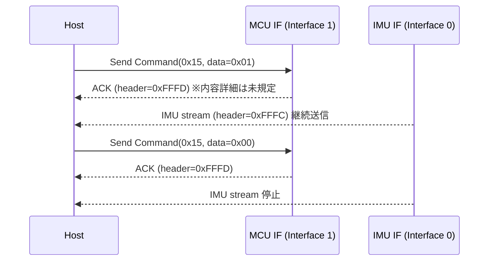

# VITURE XR Glasses（Luma 系含む）HID 3DoF（IMU）プロトコル仕様（改訂版）

## 0. 位置づけ・適用範囲

本書は、VITURE XR グラスを **3DoF の姿勢取得**（IMU トラッキング）用途でホスト（主に Windows）から利用するために必要な、USB HID 上の通信仕様を記述する。
本仕様は公開公式仕様ではなく、公開情報およびリバースエンジニアリング成果に基づく（「根拠のある仕様」章に出典を示す）。[1][2]

---

## 1. 用語

* **ホスト**: Windows 等で動作するアプリケーション側。
* **デバイス**: VITURE XR グラス本体。
* **IMU**: Inertial Measurement Unit。姿勢（3DoF）を表すセンサ系。
* **HID インターフェース**: 1 台のデバイスが複数の HID 論理デバイスとして見える構成要素（後述の IMU/MCU の 2 つ）。[1]

---

## 2. 対象デバイスと識別子

### 2.1 根拠のある仕様（ソース明記）

* USB Vendor ID は `0x35CA`。[1]
* Product ID（PID）はモデルにより異なる。少なくとも以下が列挙されている。[1]

  * Viture One: `0x1011`, `0x1013`, `0x1017`
  * Viture One Lite: `0x1015`, `0x101B`
  * Viture Pro: `0x1019`, `0x101D`
  * **Viture Luma**: `0x1131`
  * **Viture Luma Pro**: `0x1121`, `0x1141`

### 2.2 互換性に関する記述（根拠と限界）

* 上記の列挙対象（One / One Lite / Pro / Luma / Luma Pro）について、本書が扱う **WebHID ベースの同一プロトコル**（後述の 2 HID インターフェース・同一パケット構造・IMU 制御コマンド）で取り扱うことを前提として記述されている。[1]
* 一方で、**Luma Ultra** は別資料で「対応デバイス」として挙げられるが、ここで述べる **同一の WebHID 逆解析プロトコルで同様に動作する**ことまでは、その資料単体では断定できない（少なくとも “対応一覧” 以上のプロトコル詳細が同資料に明記されていない）。[3]

---

## 3. HID 論理構成（最重要）

### 3.1 根拠のある仕様（ソース明記）

デバイスは **2 つの独立した HID インターフェース**としてホストに提示される。[1]

* **IMU インターフェース**（Interface 0）: IMU 姿勢データのストリーム受信。[1]
* **MCU インターフェース**（Interface 1）: コマンド送信と応答（ACK 等）の受信。[1]

両インターフェースは以下の共通パラメータを持つ。[1]

* Usage Page: `0xFF00`（Vendor-specific）
* Usage: `0x01`
* Report ID: `0x00`
* Report Size: 64 bytes

**要件**: IMU 取得を成立させるため、ホストは **両方の HID インターフェースをオープンしなければならない**（コマンド送信は MCU、IMU データ受信は IMU）。[1]

### 3.2 図（理解補助）

```mermaid
flowchart LR
  Host[Host App] -->|HID Output Report| MCU[MCU IF (Interface 1)]
  MCU -->|HID Input Report (ACK)| Host
  IMU[IMU IF (Interface 0)] -->|HID Input Report (IMU stream)| Host
```

---

## 4. パケット共通フォーマット

### 4.1 根拠のある仕様（ソース明記）

本プロトコルで扱うパケットは、以下の構造を取る。[1]

```
Offset  Size  Description
0x00    2     Header
0x02    2     CRC-16-CCITT (big-endian)
0x04    2     Payload length (little-endian)
0x06    4     Timestamp (IMU packets)
0x0A    4     Reserved (zeros)
0x0E    2     Command ID (little-endian)
0x10    2     Message counter (little-endian)
0x12    N     Payload data
Last    1     End marker (0x03)
```

ヘッダ（`0x00..0x01`）はパケット種別を表す。[1]

* `0xFF 0xFC`: IMU データパケット
* `0xFF 0xFD`: MCU 応答（ACK 等）
* `0xFF 0xFE`: MCU コマンド

### 4.2 根拠のある仕様（ソース明記）: CRC

CRC は **CRC-16-CCITT**（polynomial `0x1021`、initial `0xFFFF`）。[1]
CRC 計算範囲は **offset `0x04` 以降**（ヘッダと CRC フィールド自体を除外）である。[1]

### 4.3 仕様（ソースから論理的に導出）

* `payload_length` は、**offset `0x06` から End marker（`0x03`）までを含むバイト数**として扱われる（生成側の長さ計算と全体構造から整合する）。[1]
* HID Report Size は 64 bytes だが、実際のパケット長は `payload_length` から復元できるため、受信側は **末尾のパディング（0 埋め等）に依存してはならない**（パケット長で切り出して処理する）。[1]

---

## 5. IMU ストリーム制御（コマンド）

### 5.1 根拠のある仕様（ソース明記）

IMU ストリーム開始・停止は MCU インターフェースへコマンド送信して行う。[1]

* Command ID: `0x15`
* Data（ペイロード）:

  * `0x01`: enable
  * `0x00`: disable

コマンドパケットはヘッダ `0xFF 0xFE` を用い、末尾に End marker `0x03` を付加する。[1]

### 5.2 図（送受信シーケンス）



---

## 6. IMU データ（姿勢）フォーマット

### 6.1 根拠のある仕様（ソース明記）

IMU データパケットはヘッダ `0xFF 0xFC` を持ち、姿勢は **Payload offset `0x12`（= byte 18）**から取得する。[1]

* byte 18–21: raw0（float32）
* byte 22–25: raw1（float32）
* byte 26–29: raw2（float32）

raw0/raw1/raw2 は **ビッグエンディアンの IEEE754 float32**として格納されており、ホスト側でバイトスワップして解釈する必要がある。[1]

### 6.2 根拠のある仕様（ソース明記）: 軸マッピング

取得した raw 値は、姿勢として扱う前に以下の変換（符号・対応付け）を行う。[1]

* `yaw  = -raw0`
* `roll = -raw1`
* `pitch = raw2`

> 注: raw0/raw1/raw2 のコメント表現（Roll/yaw/pitch 等）は資料内で混乱を招きうるため、本書は上記の **最終的な割当**を仕様として採用する。[1]

### 6.3 根拠のある仕様（ソース明記）: クォータニオン化

Euler からクォータニオンへ変換する場合、回転順序は **ZXY** を用いる。[1]

（ここでは数式展開は省略し、回転順序と入出力の取り決めのみを仕様化する。）

---

## 7. MCU 応答（ACK 等）

### 7.1 根拠のある仕様（ソース明記）

MCU 応答はヘッダ `0xFF 0xFD` として受信される。[1]

### 7.2 未規定（情報不足）

ACK 内のペイロード構造（成功/失敗コード、対応する Message counter の関係、再送条件等）は、少なくとも参照ソース内で十分に定義されていないため **本書では規定しない**。[1]

---

## 8. 参考情報（非規定）

本章は仕様ではなく、設計判断の補助を目的とする。

### 8.1 参考（ソース明記）: 公式 Linux SDK が提供する抽象化

VITURE は Linux 向け SDK を提供しており、IMU データ取得・IMU ストリーム制御・IMU 周波数設定・解像度切替等の API をうたっている。[5]
ただし、当該 SDK は利用許諾契約（SDK License Agreement）の対象であり、契約条件に従う必要がある。[6]

### 8.2 参考（ソースから論理的に導出）: “どちらが MCU/IMU か判別できない” 場合

ソース上の WebHID 手順では、列挙された VITURE デバイスをすべて open し、送信可否でコマンドの宛先を事実上判別している（IMU 側はコマンドを拒否する場合がある）。[1]
同様の戦略は hidapi 等でも採用し得るが、Windows のデバイスパス表現や権限モデルに依存するため、本書は仕様としては規定しない。

### 8.3 推測・推奨（ソースなし）

* 実運用では CRC 不一致・パケット断片化等のエラーパスを想定し、ヘッダ・長さ・終端 `0x03` を用いたフレーミング復旧（次フレーム同期）を実装しておくことが望ましい。
* IMU の “リセンタ（正面合わせ）” は、現時点姿勢を基準として後続姿勢に補正を掛ける方式が一般的である（資料にも同趣旨の処理例があるが、ここでは設計上の推奨として扱う）。[1]

---

## 9. 参照資料・ライセンス（統一形式）

[1] 「Viture XR Glasses Protocol Documentation（VITURE_PROTOCOL.md）」ユーザー提供ファイル。内容: VID/PID、2 HID インターフェース、パケット構造、CRC、IMU enable（0x15）、IMU データ（byte 18 起点 float32）、軸マッピング、ZXY 変換。
ライセンス: 本ファイル単体には明記されないが、入手元として広く流通している GitHub リポジトリ（[2]）は MIT License 表記。
根拠箇所: 

[2] bfvogel, “viture-webxr-extension” (GitHub). 逆解析プロトコル文書の配布元として参照。リポジトリに MIT License 表記。
ライセンス: MIT License。 ([GitHub][1])

[3] wheaney, “XRLinuxDriver” (GitHub). 対応デバイス一覧に VITURE Luma Ultra を含む。リポジトリに GPL-3.0 license 表記。
ライセンス: GPL-3.0。 ([GitHub][2])

[4] mgschwan, “viture_virtual_display” (GitHub). 関連する逆解析実装として参照されることがある。リポジトリに MIT license 表記。
ライセンス: MIT License。 ([GitHub][3])

[5] VITURE, “VITURE XR Glasses SDK for Linux” (公式). IMU データ取得、IMU イベント制御、IMU 周波数 API、解像度切替等の提供を記載。
ライセンス: 公式 SDK のため別途許諾条件に従う（[6] 参照）。 ([viture.com][4])

[6] VITURE, “VITURE SDK LICENSE AGREEMENT” (公式). SDK 利用に関する契約文書の存在および “Effective September 2025” 等が検索結果として確認できる。
ライセンス: 契約（プロプライエタリ）。 ([viture.com][5])

[1]: https://github.com/bfvogel/viture-webxr-extension "GitHub - bfvogel/viture-webxr-extension"
[2]: https://github.com/wheaney/XRLinuxDriver "GitHub - wheaney/XRLinuxDriver: Linux service for interacting with XR devices"
[3]: https://github.com/mgschwan/viture_virtual_display "GitHub - mgschwan/viture_virtual_display: Virtual display with Viture Pro XR glasses using hdmi in on an OrangePi"
[4]: https://www.viture.com/developer/viture-one-sdk-for-linux "VITURE XR Glasses SDK for Linux"
[5]: https://www.viture.com/viture-sdk-license-agreement?utm_source=chatgpt.com "VITURE SDK LICENSE AGREEMENT | VITURE: Next Gen ..."
